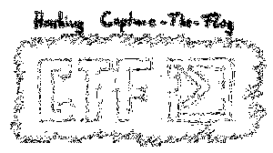

# Simple Image
**Category:** forensic
> Hi, i like this website, ctflearn.com so i decided to share my happiness to you all guys. please, can i smile for you all guys?
> 
> https://drive.google.com/open?id=17NUxdVfobLpFfJpbXf0EZ6WLkjsbGPSa
---

Ketika kita buka gambar yang didownload disana tidak ada informasi apa-apa yang dapat membantu.

Kita juga tidak menemukan informasi dengan perintah `strings`, `file`, `pngcheck`, `binwalk`, `foremost`. Hmm sungguh "**tersembunyi**".

Untuk menyelesaikan challenge ini kita perlu **Image Editor** untuk bisa mengedit saturasi dan komposisi warna yang ada pada gambar. Karena mungkin gambar ini sudah dilakukan _steganografi_.

Tools yang dipakai bisa bermacam-macam, seperti Photoshop, GIMP, dll yang memiliki fitur filter dan komposisi warna. Namun yang akan kita gunakan adalah aplikasi khusus _steganografi_, sehingga kita hanya memilih komposisi yang kita inginkan.

Download dan instal aplikasi yang diperlukan, yaitu Stegsolve.
```bash
wget http://www.caesum.com/handbook/Stegsolve.jar -O stegsolve.jar
chmod +x stegsolve.jar
```
* Baris pertama kita download dari situsnya dan simpan di file `stegsolve.jar`
* Baris kedua kita membuat file `stegsolve.jar` menjadi _executable_

Selanjutnya kita buka aplikasi ini. Karena aplikasi ini berekstensi `.jar` maka ita perlu membukanya menggunakan **Java Runtime**.
```bash
java -jar ./stegsolve.jar
```



Selanjutnya buka gambar yang akan kita teliti. Dan terakhir hanya pilih filter komposisi warna dengan klik tanda panah sampai akhirnya kalian menemukan flag-nya.

> Flag terlihat jelas di filter: **Red plane 0**, **Green plane 0**, dan **Blue plane 0**

flag : `flag{smile_for_you}`

